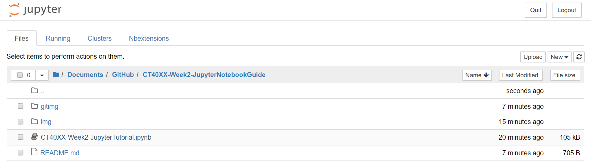

# CT40XX Jupyter Notebook Guide
This repository contains a quick cheat sheet guide on how to use Jupyter Notebook. To view it, open `CT40XX-Week2-JupyterTutorial.ipynb` in Jupyter Notebook.

## Installing Jupyter Notebook
The easiest and recommended way to install Jupyter Notebook is to install the Anaconda distribution to your computer, this will install Python and other libraries that we will be using over the duration of the course. You can download and install it by going to the [Anaconda Homepage](https://www.anaconda.com/distribution/#download-section).

Once you have installed the Anaconda Distribution, it is recommended that you restart your computer. Afterwards, you can find Jupyter Notebook in your Windows start menu:

## Opening the Notebook file
Jupyter Notebook will then open in your default browser. Once you have either cloned or downloaded this repository, open Jupyter Notebook and navigate to the directory where you put `CT40XX-Week2-JupyterTutorial.ipynb` using Jupyter notebooks file explorer, and then just simply click on the file.

